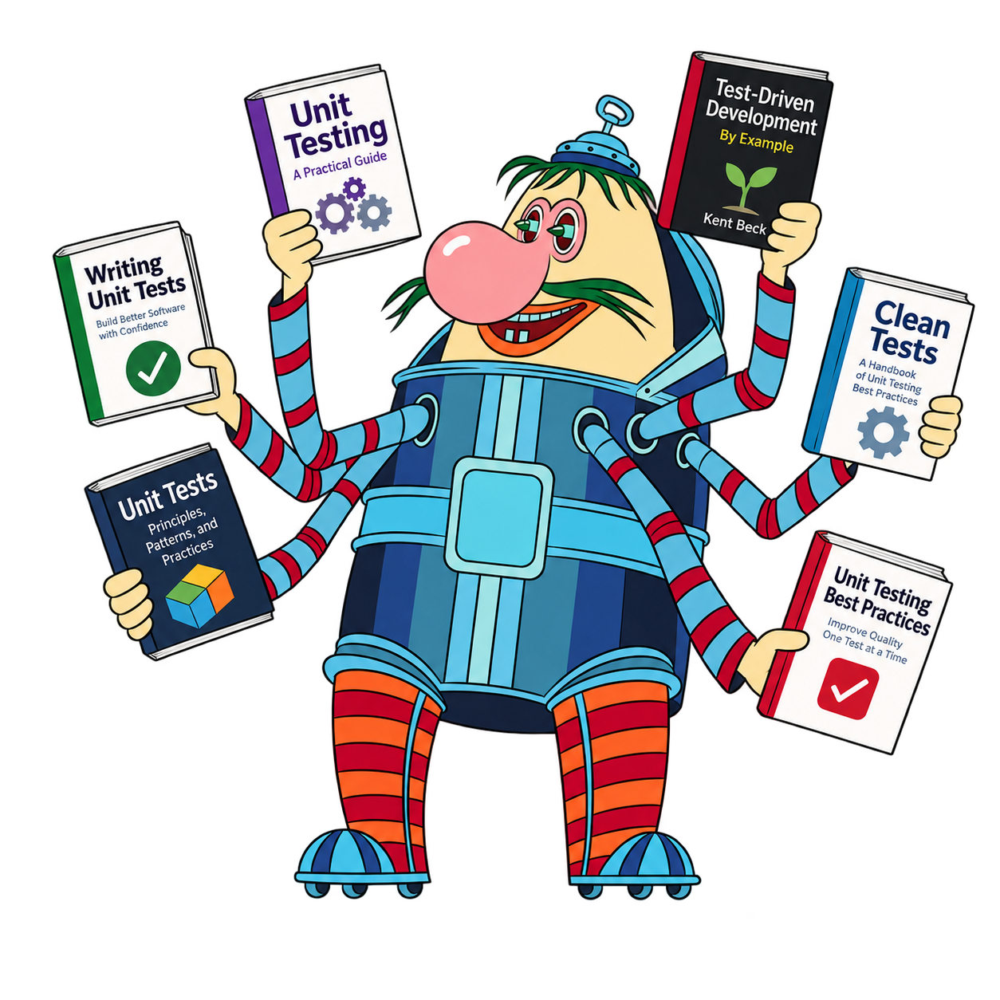
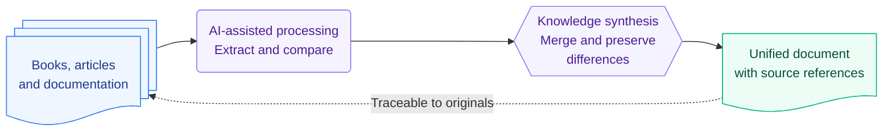

# Gromozeka

  

Gromozeka is a local-first knowledge synthesis tool that turns books, articles, documentation, and other materials into a unified, verifiable document. It combines overlapping knowledge while preserving important details, differing perspectives, contradictions, and links to the original sources.

